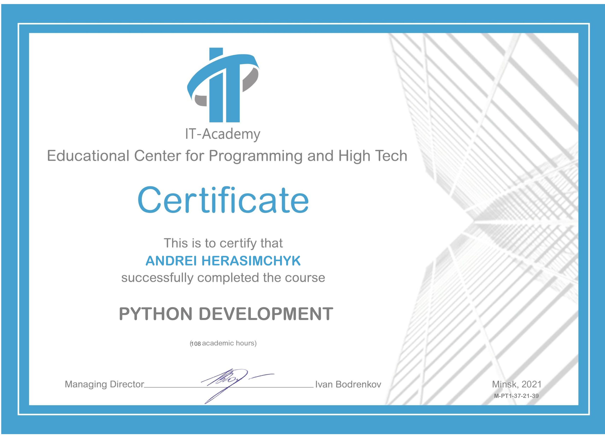


# Andrei Herasimchyk
## Python, Django Developer 
Minsk  
Cell: +375 (29) 642-40-42  
Email: [gerasimchick@tut.by](mailto:gerasimchick@tut.by)   
Linkedin: [https://www.linkedin.com/in/андрей-герасимчик-4286aa195/](https://www.linkedin.com/in/андрей-герасимчик-4286aa195/)
### Skills	 
* Python
* Django, 
* OOP, 
* HTML, 
* CSS, 
* JS, 
* REST, 
* Git,
* MySQL,
* Ubuntu,
* Linux

### English level
A1(Beginner), continue to study

### Experience
**IT-Academy / Internship**  
03.2021 – 06.2021  
Course project "News portal, car dealers’s catalog", backend development, layout based on a ready-made template [https://github.com/demmi/clickoncar](https://github.com/demmi/clickoncar)  
Joint project "Chess", participation in the development, position of Project Manager [https://github.com/demmi/M-PT1-37-21/tree/Chess/Tasks/Gerasimchik_Tasks/Chess](https://github.com/demmi/M-PT1-37-21/tree/Chess/Tasks/Gerasimchik_Tasks/Chess)

**БезРуля.Ру / Chief Editor**  
2015 – PRESENT  
Understanding the processes of a news portal, the basics of SEO

### Education	
**RS School / Junior Frontend, JavaScript Developer**  
June 2021 – September 2021, Minsk  
Development JavaScript, HTML apps.  

**IT Academy / Junior Python, Django Developer**  
March 2021 – June 2021, Minsk  
Development of apps in Python, Django, including OOP. Basics of HTML, CSS, JS, REST, Git. Average score 9.6.  
Certificate 

**Belarusian State University of Informatics and Radioelectronics / Electronic engineer**  
1992 – 1998, Minsk

### Activities	
* Participated in the improvement of the HDMI-CEC plug-in in the firmware of the GI-8120 series satellite receivers. 
* Study JavaScript, RS-School courses 
* “Django 3.0. The practice of creating websites in “Python”, Vladimir Dronov 
* “Python Programming” Mark Lutz 
* “Clean Code. Creation, Analysis and Refactoring ”, Robert Martin  

### Recommendations	
* Recommendation of the Educational Center for Programming and High Technologies (IT-Academy).
* Mikita Tsiarentsyeu, Lead Software Engineer at EPAM Systems, terentievnikita@gmail.com, [https://linkedin.com/in/mikita-tsiarentsyeu-32036a197](https://linkedin.com/in/mikita-tsiarentsyeu-32036a197)
